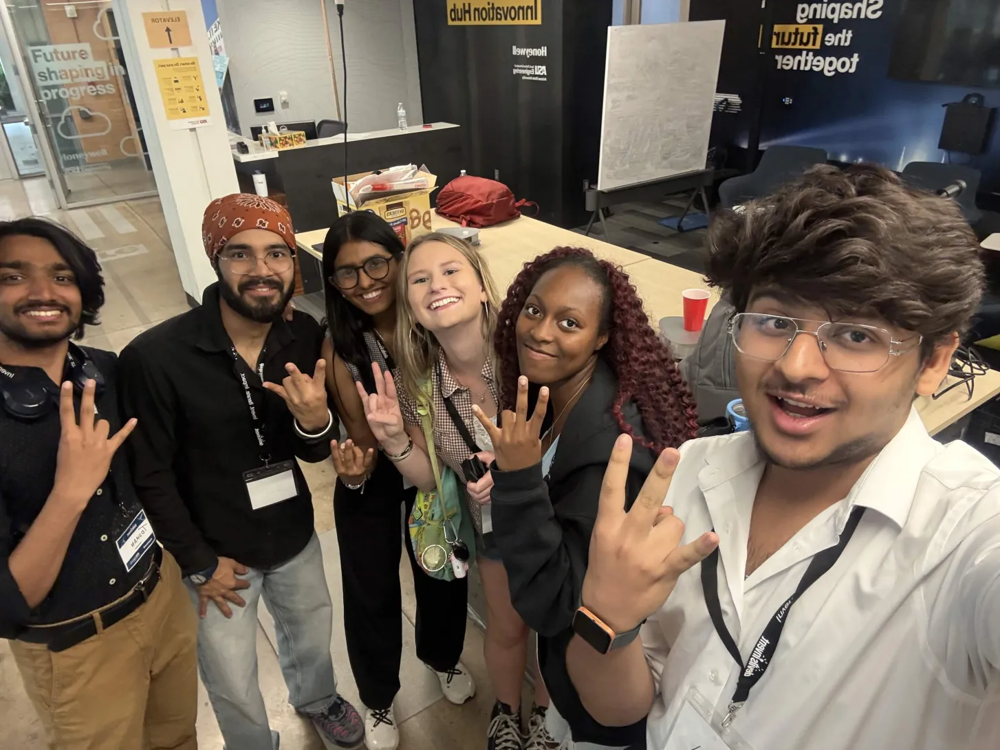
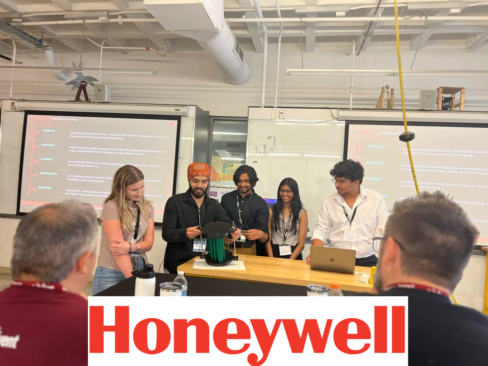
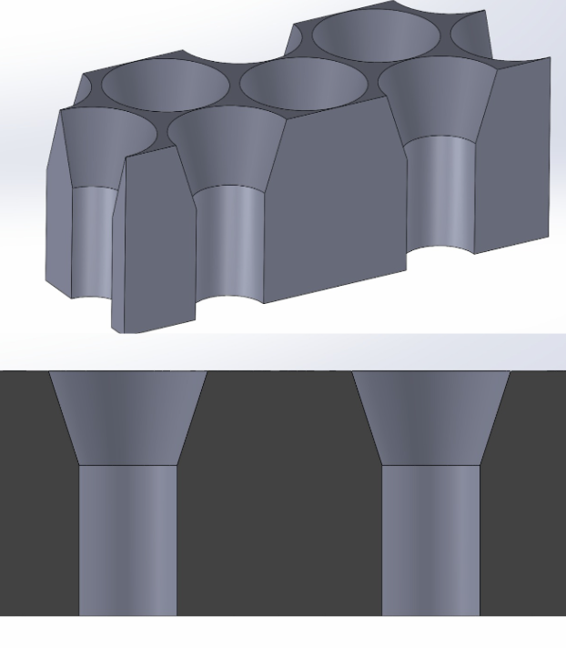
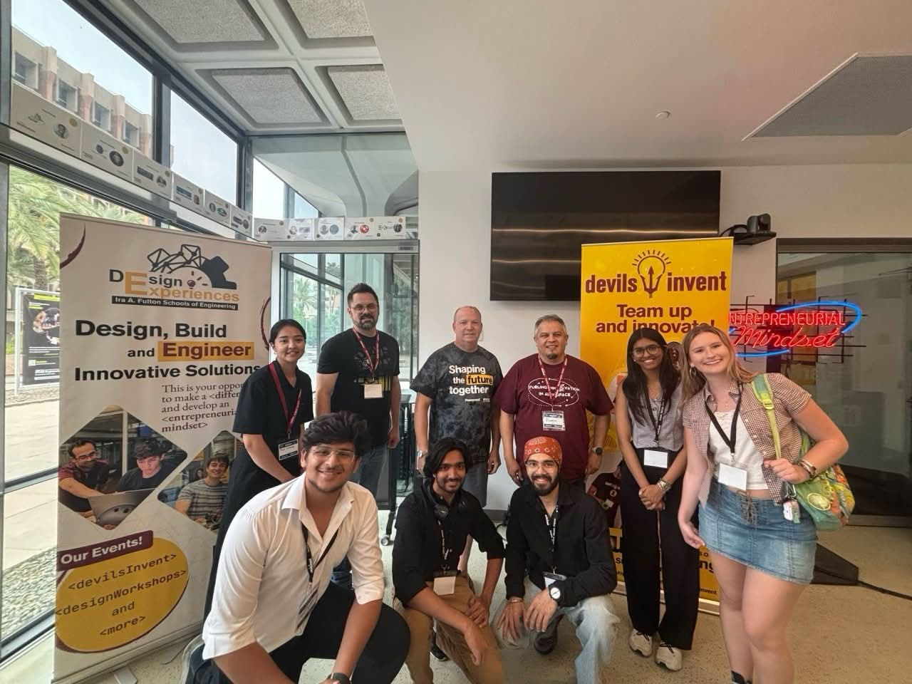

# Well, Honey! — Microtube Insertion System

🥉 3rd Place Winner — Honeywell x Arizona State University Devils Invent Hackathon 2026

> "We're not replacing the system — we're removing its biggest bottleneck."

## Overview

Well, Honey! is a passive, geometry-driven microtube insertion system for heat exchanger assembly. The goal was to design an intelligent robotic approach that can align and insert thousands of delicate tubes into a tubesheet without deformation.

## Hackathon Theme

**Optimized and Intelligent Control Systems**

## The Challenge

Heat exchanger manufacturing requires precise insertion of large numbers of microtubes. The process is typically:
- manual
- slow
- skill-dependent
- prone to rework
- difficult to scale

## Our Solution

Our solution combined:

- Cone-shaped / chamfered holes to guide tubes into place
- Controlled vibration so the tubes could self-align
- A linear actuator to separate the plates after insertion
- 3D-printed prototypes to physically demonstrate and validate the concept

## Why It Matters

This approach makes the assembly process:
- simpler
- faster
- more scalable
- more repeatable

## Results

- 🥉 3rd place
- 🏆 $2500 prize
- Built during Honeywell x ASU Devils Invent Hackathon 2026

## Team

- Prajval Arora
- L Johnson
- Toshan Jagani
- Riya Mehta
- Sameerjeet Singh Chhabra

## Media

## Presentation

[View the full presentation](docs/presentation.pdf)

## Keywords

#Robotics #Automation #Aerospace #Hackathon #ASU #Engineering #Honeywell #ROS
